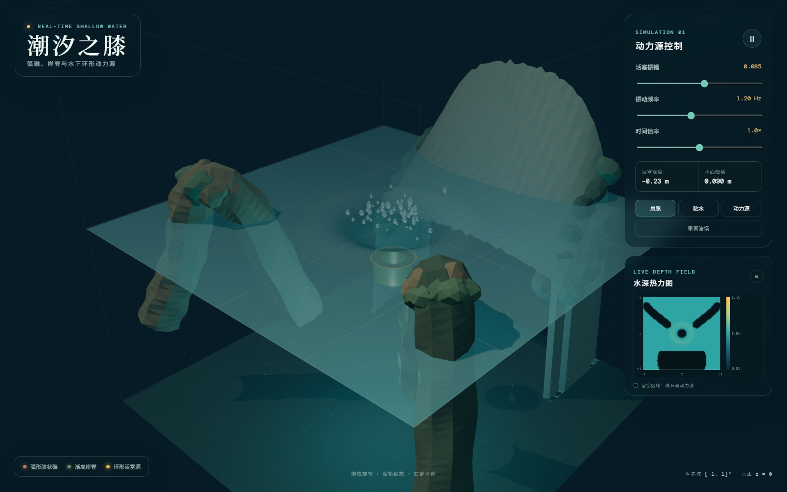

# 潮汐之膝：交互式礁域流体模拟

这是一个运行在浏览器中的三维浅水波模拟。计算域为 `[-1, 1]³`，数学坐标约定 `z` 轴竖直，静水面为 `z = 0`。

网页端是一个个人数值实验：重点在可交互的场景、离散模型和可复现实验，不把结果当作工程设计结论。



## 场景模型

- 两座膝状弧礁分别围绕 `(−0.7, 0.5)` 与 `(0.7, 0.5)` 弯折，最高点约为 `z = 0.16`，因此“膝盖”露出水面。
- 后方岸脊占据 `x ∈ [−0.6, 0.6]`、`y ∈ [−1, −0.5]`。其冠部从 `y = −0.5` 的水下逐渐升高，到 `y = −1` 附近明显出水，并在横向形成外凸圆冠。
- 中央动力源是外半径 `0.10`、内半径 `0.06`、高度 `0.10` 的环形活塞。静止中心深度为 `z = −0.22`，默认振幅 `0.085`；最大可调振幅 `0.140` 下，顶部最高仍位于 `z = −0.030`，全程不出水。

水面采用规则网格离散的阻尼浅水波方程实时求解。环形源把活塞速度耦合到水面；礁石覆盖区施加局部阻尼，边缘带使用吸收衰减以减少不自然反射。视觉中的水面起伏来自求解结果，不是预录动画。

活塞上冲会触发弹道水滴、扩散泡沫环和水下高光脉冲，强化撞击感。右侧热力图显示瞬时水深，色轴范围为 `0.82–1.18 m`；两座弧礁、后方岸脊和环形动力源在图中留空。

项目现在包含两级求解器：网页端负责即时交互预览；需要三维自由液面、近壁压力和绕流细节时，使用 [DualSPHysics 高精度后端](engine/dualsphysics/README.md)。后者生成约 50 万至 119 万粒子的 GPU SPH 算例，不再依赖高度场假设。引擎候选、选择理由和实测粒子分类见 [引擎调研报告](ENGINE_RESEARCH.md)。

## 运行

```bash
npm install
npm run dev
```

浏览器打开终端显示的地址。右侧面板可调振幅、频率和时间倍率，并可切换总览、贴水、动力源三个机位。

## 验证

```bash
npm test
npm run build
```

测试会检查动力源尺寸、全程浸没、弧礁出水和后方礁脊随 `−y` 方向升高等几何约束。

更完整的几何方程、数值方法与俯视构型见 [DESIGN.md](DESIGN.md)。

## 公开范围

- 网页预览、场景几何和算例生成脚本属于本项目，按 [MIT License](LICENSE) 发布。
- `engine/dualsphysics` 只保存算例生成和启动脚本；DualSPHysics 本体需要从官方渠道取得，并遵守其许可条款。
- 运行所需的第三方资料、浏览器缓存、编译目录和大体积求解输出不放入仓库。
